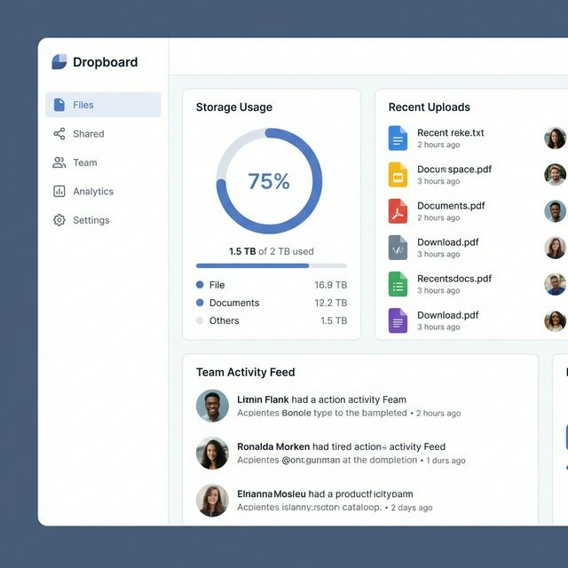
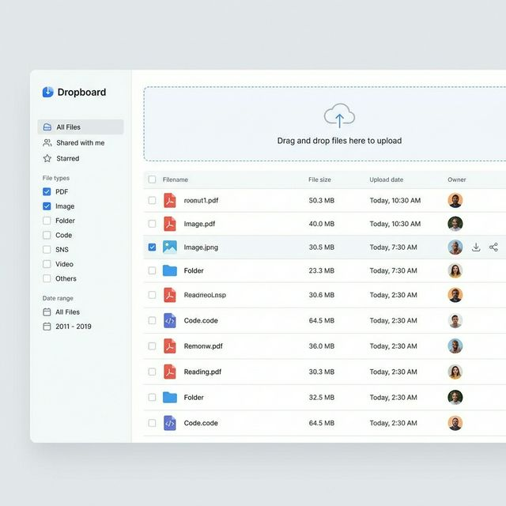
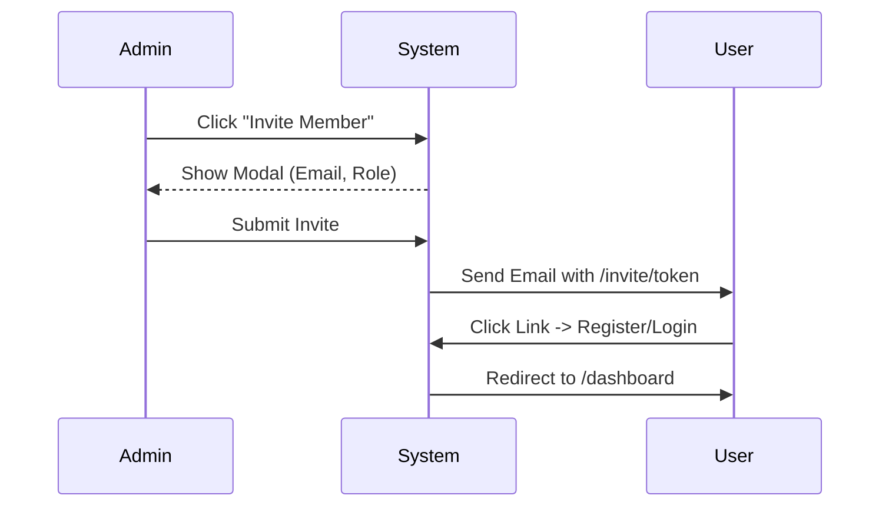
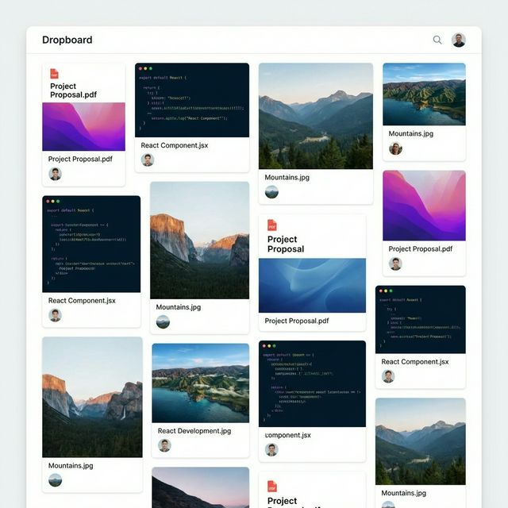
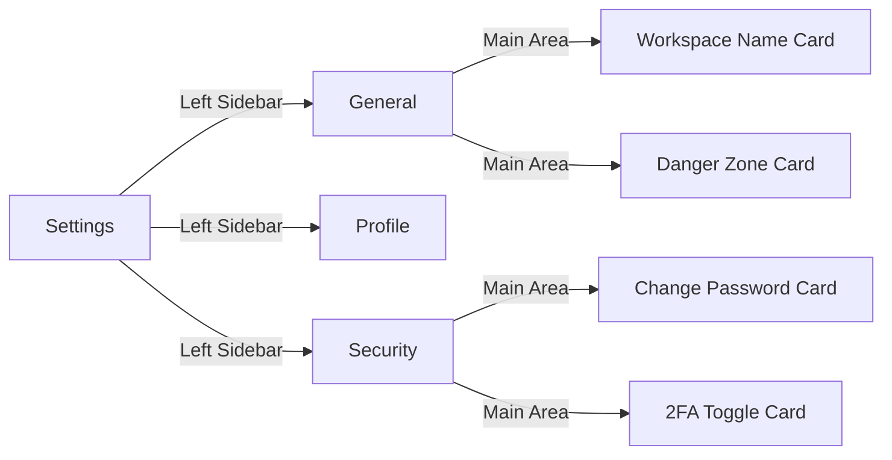

# Dropboard UI/UX Refactor Plan

## 1. Vision & Goals

Using the generated mockups as a guide, we aim to transform Dropboard into a **business-first, professional file management platform**. The new design focuses on:

- **Clarity:** Reducing clutter, emphasizing content.
- **Business Utility:** Highlighting key metrics like storage usage and activity.
- **Trust:** Using a clean, modern aesthetic (Inter font, slate/blue palette) that feels secure and stable.

## 2. Design System

- **Typography:** Inter or Geist Sans. Clean, legible, professional.
- **Color Palette:**
  - Primary: Corporate Blue (`#2563EB` or similar)
  - Background: Crisp White (`#FFFFFF`) & Light Gray (`#F8FAFC`)
  - Text: Slate (`#1E293B`, `#64748B`)
  - Borders: Subtle (`#E2E8F0`)
- **Spacing:** Generous padding (16px/24px base) to reduce density.
- **Components:** Shadcn UI (already in use) with customized `radius-md` or `radius-sm` for a more "pro" look.

---

## 3. High-Fidelity Concepts

### A. Dashboard Overview

**Goal:** Provide instant visibility into workspace health and recent actions.

**Key Improvements:**

1.  **Metric Cards**:
    - **Storage Usage**: Circular progress bar for instant understanding of capacity.
    - **Quick Stats**: Total files, active members.
2.  **Recent Uploads**:
    - List view with clear file type icons.
    - Owner avatars to show _who_ uploaded what.
3.  **Activity Feed**:
    - Clean timeline view of team actions.

### B. File Management (Drops)

**Goal:** Efficient file organization and retrieval.

**Key Improvements:**

1.  **Drag & Drop Zone**: Prominent, branded upload area at the top.
2.  **Data Table**:
    - **File Icons**: Distinct icons for PDF, Image, Code, etc.
    - **Metadata**: Clear columns for Size, Date, Uploaded By.
    - **Hover Actions**: Download, Share, Delete buttons appear on hover to keep interface clean.
3.  **Sidebar Filters**: Quick access to file types (PDF, Image, Video) and date ranges.

### C. Team Management (Concept)

_Image generation skipped, text description below_

**Goal:** Clear hierarchy and easy invitation flow.

1.  **Member List**:
    - Table view similar to Files.
    - Columns: User Info (Avatar + Name + Email), Role (Badge), Status (Active/Invited), Joined Date.
    - **Role Badges**: Color-coded (Purple for Owner, Blue for Admin, Green for Member).
2.  **Invite Flow**:
    - Modal dialog with clear email input and role selection.
    - "Copy Link" feature prominent.

### D. Pinboard (Curated View)

**Goal:** Quick access to high-priority files in a visual way.

**Visual Concept:**

- **Grid Layout (Masonry):** Unlike the file list, Pinboard uses a card-based grid layout to emphasize visual recognition.
- **File Cards:**
  - **Thumbnail:** Large preview for images/PDFs. Generic but styled icon for code/other files.
  - **Info:** Filename truncated intelligently, "Pinned by [User]" avatar.
  - **Actions:** Prominent "Unpin" button (icon style) and "Open" button.
- **Empty State:** Beautiful illustration encouraging users to "Pin important files for quick access".

### E. Settings Redesign

**Goal:** Organize complex configurations into digestible sections.

**Visual Concept:**

- **Layout:** Two-column layout.
  - **Left (25%):** Vertical Navigation (General, Profile, Security, Billing).
  - **Right (75%):** Content Area with Scrollable Cards.
- **Form Design:**
  - **Card Grouping:** Each logical section (e.g., "Change Password") is its own white card with a title and description.
  - **Input Fields:** Max-width constrained (e.g., `max-w-md`) for better readability on wide screens.
  - **Danger Zone:** Distinct red-bordered card for destructive actions (Delete Workspace/Account).
- **Interactive Elements:**
  - **Save Buttons:** Verify changes before enabling save (dirty state tracking).
  - **Toasts:** Feedback on success/error.

---

---

## 4. Implementation Steps

### Phase 1: Layout & Navigation

- [ ] Refactor Sidebar to match new clean aesthetic (remove clutter).
- [ ] Update Topbar breadcrumbs and user menu.
- [ ] Standardize page padding/margins across app.

### Phase 2: Dashboard Redesign

- [ ] Create `StorageWidget` component (Circular progress).
- [ ] Create `RecentActivity` timeline component.
- [ ] Create `RecentUploads` list component.
- [ ] Assemble new `/dashboard` page layout.

### Phase 3: File Manager Upgrade

- [ ] Enhance `DataTable` with better spacing and typography.
- [ ] Implement new `FileIcon` system.
- [ ] Add sidebar filters to `/dashboard/drops`.
- [ ] Improve Drag & Drop zone styling.

### Phase 4: Pinboard & Visuals

- [ ] Create `FileGrid` component (Masonry support if possible).
- [ ] Design `FileCard` with large preview area.
- [ ] Add "Unpin" flow and animations.
- [ ] Implement empty state illustrations.

### Phase 5: Team & Settings Refactor

- [ ] Create `SettingsSidebar` navigation component.
- [ ] Refactor Profile settings into `ProfileCard`.
- [ ] Refactor Password update into `SecurityCard`.
- [ ] Redesign Team Management page with new `MemberTable` and `InviteDialog`.
- [ ] Add "Danger Zone" styling for destructive actions.

---

## 5. Mobile Considerations

- **Responsive Tables**: Horizontal scroll or card view for mobile.
- **Navigation**: Improved bottom sheet/drawer (already started with sidebar fix).
- **Touch Targets**: Ensure actions are 44px+ sized.
